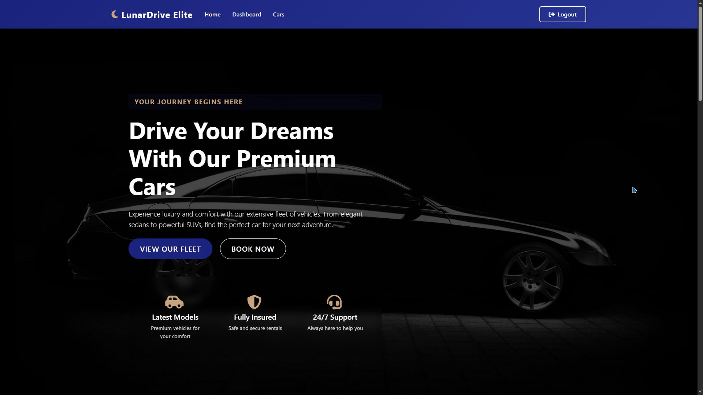
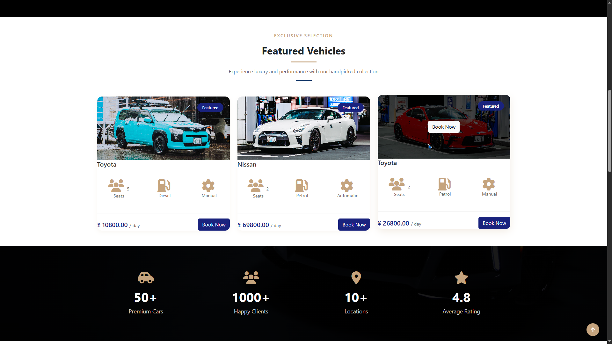

# 🚗 Lunar Drive Elite

> A modern, responsive web-based car rental application that provides a seamless experience for both users and administrators.


## 📝 Description

Lunar Drive Elite is a sophisticated car rental management system that enables users to browse and book premium vehicles while providing administrators with powerful tools to manage the fleet and monitor bookings. The application features a sleek, modern UI design inspired by top Dribbble shots, ensuring an engaging user experience across all devices.

## ✨ Features

### User Features
- 👤 User Authentication
  - Registration with email verification
  - Secure login system
  - Profile management
- 🚙 Car Rental
  - Browse available vehicles
  - View detailed car specifications
  - Real-time availability checking
  - Booking management
- 💳 Booking Management
  - View booking history
  - Dummy payment simulation
  - Booking confirmation emails
- 📱 Responsive Design
  - Mobile-first approach
  - Cross-browser compatibility
  - Smooth animations

### Admin Features
- 📊 Dashboard
  - Overview of bookings and revenue
  - User statistics
  - Fleet management
- 🎛️ Management Tools
  - Add/Edit/Delete car listings
  - User management
  - Booking oversight
  - System configuration

## 🛠️ Technologies Used

- **Frontend**
  - HTML5
  - CSS3
  - Bootstrap 5.3
  - JavaScript (ES6+)
  - Font Awesome Icons
  
- **Backend**
  - PHP 7.4+
  - MySQL 8.0+
  - PHPMailer
  
- **Development Tools**
  - XAMPP
  - Git
  - VS Code
  - MySQL Workbench

## 🚀 Setup Instructions

### Prerequisites
- XAMPP (with PHP 7.4+ and MySQL 8.0+)
- Git
- Web browser
- Text editor (VS Code recommended)

### Installation Steps

1. **Clone the Repository**
   ```bash
   git clone https://github.com/yourusername/lunar-drive-elite.git
   ```

2. **Configure XAMPP**
   - Copy the project folder to `C:/xampp/htdocs/`
   - Start Apache and MySQL services in XAMPP Control Panel

3. **Database Setup**
   - Open phpMyAdmin (http://localhost/phpmyadmin)
   - Create a new database named 'garage'
   - Import the database schema from `database/garage.sql`

4. **Configure Email Settings**
   - Open `includes/config.php`
   - Update SMTP settings with your email credentials
   ```php
   define('SMTP_HOST', 'smtp.gmail.com');
   define('SMTP_USERNAME', 'your-email@gmail.com');
   define('SMTP_PASSWORD', 'your-app-password');
   ```

5. **Access the Application**
   - User Interface: http://localhost/Garage/
   - Admin Dashboard: http://localhost/Garage/admin/

### Default Admin Credentials
- Email: admin@lunardrive.com
- Password: admin123

## 📁 Folder Structure

```
Garage/
├── admin/                 # Admin dashboard files
│   ├── dashboard.php
│   ├── manage-cars.php
│   └── manage-users.php
├── css/                   # Stylesheets
│   ├── style.css
│   └── admin.css
├── images/               # Image assets
├── includes/             # PHP includes
│   ├── config.php
│   ├── functions.php
│   └── db.php
├── js/                   # JavaScript files
├── vendor/               # Composer dependencies
├── index.php            # Main entry point
├── login.php            # User login
├── register.php         # User registration
└── README.md            # This file
```

## 📸 Screenshots

### User Interface

*Homepage - Welcome to Lunar Drive Elite*


*Browse Our Premium Fleet*


*Detailed Car Information*


*Seamless Booking Experience*


*User Dashboard Overview*

### Admin Interface

*Administrative Control Panel*

### Profile Management

*User Profile Management*

### Featured Section

*Featured Vehicles Showcase*

## 🔜 Future Improvements

1. **Enhanced Security**
   - Two-factor authentication
   - Advanced password policies
   - Login attempt monitoring

2. **Additional Features**
   - Password reset functionality
   - Login history tracking
   - Multiple payment gateways
   - Real-time chat support
   - PDF invoice generation

3. **Technical Improvements**
   - API implementation
   - Caching system
   - Image optimization
   - Performance optimization

4. **User Experience**
   - Dark mode support
   - Multiple language support
   - Advanced search filters
   - User reviews and ratings

## 📄 License

This project is licensed under the MIT License - see the [LICENSE](LICENSE) file for details.

---

## 🤝 Contributing

Contributions are welcome! Please feel free to submit a Pull Request. For major changes, please open an issue first to discuss what you would like to change.


---
